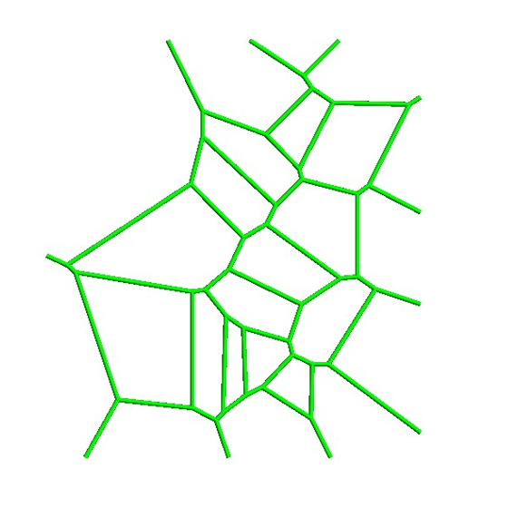
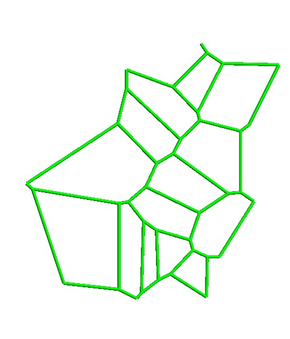

# voronoi_mesher

This guy here meshes a point cloud given in the inputs.
the output us in GiD format, for which you could use the free version of pre-post processor [GiD](https://www.gidhome.com/)

Some simple examles: 

